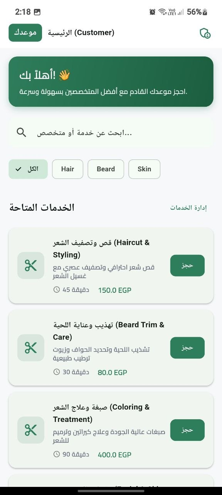
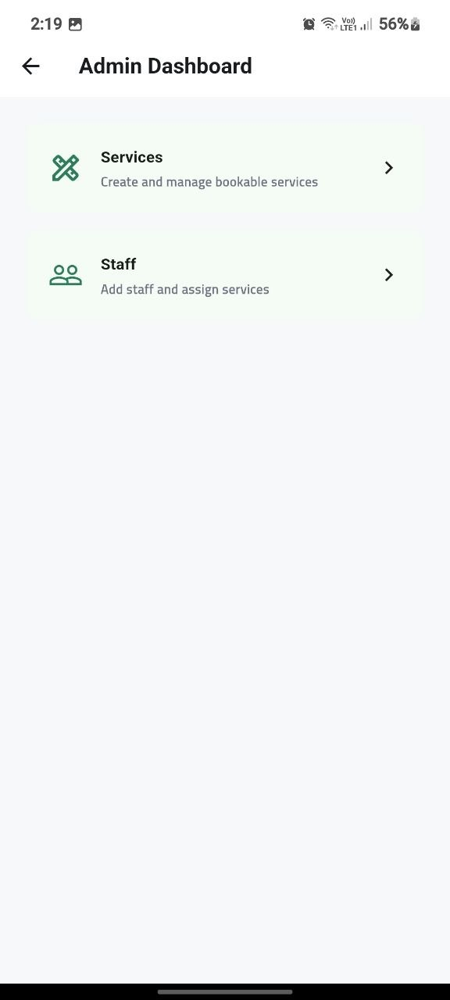
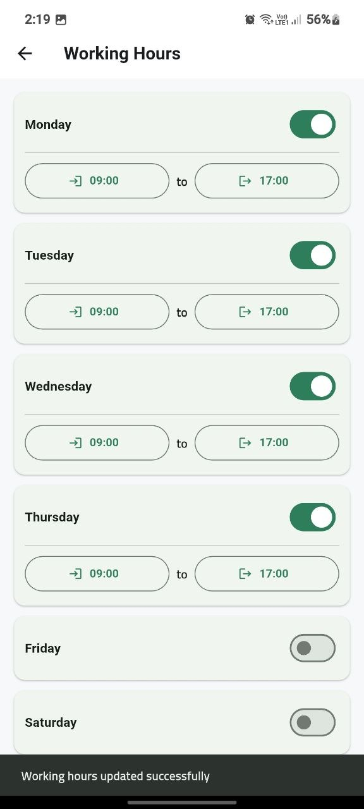

# Mawidak (موعدك) - Smart Booking & Appointment Management

<div align="center">


**Mawidak (موعدك)** is a modern, modular Flutter application for booking appointments, managing salon/clinic services, staff assignments, and weekly working hours. Built using **Clean Architecture**, **Riverpod 3**, **GoRouter**, and **Injectable/GetIt**.

</div>

---

## 📸 Screenshots Gallery

<div align="center">

| Splash Screen | Customer Home | Admin Dashboard | Working Hours |
|:---:|:---:|:---:|:---:|
|  |  |  |  |
| *Splash Screen* | *Customer Services & Booking* | *Admin Dashboard Hub* | *Weekly Schedule Customizer* |

</div>

---

## ✨ Key Features

### 👤 Customer Experience
- **Interactive Service Catalog**: Browse services with real-time category filtering (*Hair, Beard, Skin, All*) and instant search.
- **Service Details**: View duration in minutes, transparent pricing in EGP, and service descriptions.
- **Specialists Showcase**: Horizontal carousel showing team members, ratings, and specialties.
- **Instant Booking Action**: Quick reservation confirmation dialogs.

### 🛠️ Admin Dashboard & Business Management
- **Services CRUD**: Create, view, update, and delete bookable services with validation.
- **Staff Directory**: Add specialists, update contact details, and assign multiple services using interactive filter chips.
- **Weekly Schedule Customizer**:
  - Toggle working status for each weekday.
  - Interactive native time pickers for Start & End hours.
- **In-Memory Mock Fallback**: Full interactive testing mode enabled out of the box without requiring a live backend server.

---

## 🏗️ Architecture & Project Structure

The project strictly adheres to **Clean Architecture** principles:

```
lib/
├── config/
│   ├── di/                 # Dependency Injection (GetIt + Injectable)
│   └── router/             # Routing configuration (GoRouter)
├── core/
│   ├── constants/          # Colors, text styles, app constants
│   ├── error/              # Failures and Exception definitions
│   ├── network/            # Dio client and network adapters
│   └── theme/              # Material 3 theme configuration
└── features/
    ├── auth/               # Authentication feature
    │   ├── data/
    │   ├── domain/
    │   └── presentation/
    ├── busniess/           # Business management (Services, Staff, Working Hours)
    │   ├── data/
    │   │   ├── datasources/    # Remote data sources & Mock in-memory engine
    │   │   ├── models/         # JSON-serializable DTOs
    │   │   └── repositories/   # Repository implementations
    │   ├── domain/
    │   │   ├── entities/       # Pure business entities
    │   │   ├── repositories/   # Domain repository contracts
    │   │   └── usecases/       # Single-responsibility use cases
    │   └── presentation/
    │       ├── notifiers/      # Riverpod 3 notifiers
    │       ├── pages/          # UI Screens (Customer, Admin, Services, Staff, Hours)
    │       └── providers/      # Riverpod provider definitions
    └── splash/             # Splash screen with auto-navigation
```

---

## 🛠️ Tech Stack & Dependencies

- **Framework**: [Flutter](https://flutter.dev/) (SDK ^3.9.2)
- **State Management**: [flutter_riverpod](https://pub.dev/packages/flutter_riverpod) ^3.0.3 & [riverpod_annotation](https://pub.dev/packages/riverpod_annotation) ^3.0.3
- **Navigation**: [go_router](https://pub.dev/packages/go_router) ^14.6.2
- **Dependency Injection**: [get_it](https://pub.dev/packages/get_it) & [injectable](https://pub.dev/packages/injectable)
- **Networking**: [dio](https://pub.dev/packages/dio) ^5.7.0 (Configured for Odoo JSON-RPC `call_kw`)
- **Local Storage**: [hive_ce_flutter](https://pub.dev/packages/hive_ce_flutter)
- **Functional Programming**: [dartz](https://pub.dev/packages/dartz) (Either<Failures, T>)
- **Typography & Theme**: [google_fonts](https://pub.dev/packages/google_fonts) (Cairo font for Arabic/English typography)

---

## 🚀 Getting Started

### 1. Prerequisites
- [Flutter SDK](https://docs.flutter.dev/get-started/install) installed (v3.24+ recommended)
- A connected device, emulator, or simulator

### 2. Installation
Clone the repository and install dependencies:
```bash
git clone https://github.com/muhamedamin308/mawidak.git
cd mawidak
flutter pub get
```

### 3. Generate Code
Run `build_runner` to generate Riverpod providers and Injectable DI configuration:
```bash
dart run build_runner build --delete-conflicting-outputs
```

### 4. Run the Application
```bash
flutter run
```

---

## 📝 License
This project is proprietary and intended for private development.
